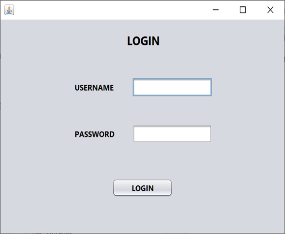
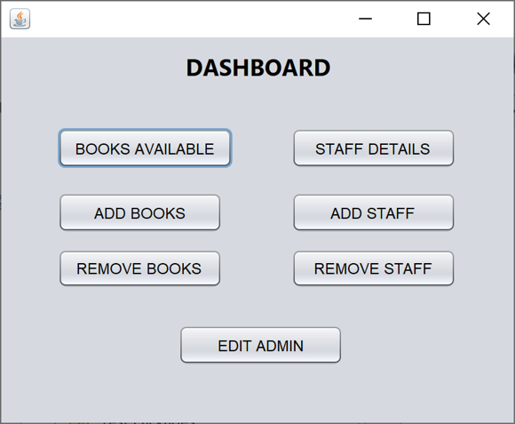
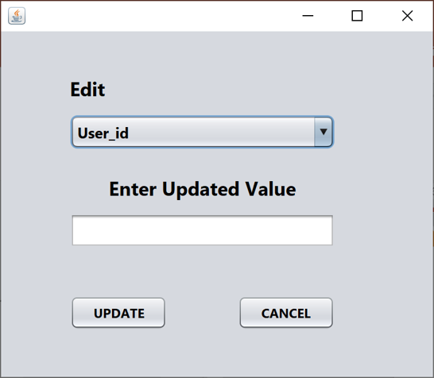

# Library Management System

This **Library Management System** is a desktop application developed using **Java Swing** and **MySQL**. The system provides an interface to manage books, staff, and administrative functions within a library. It allows the user to add, remove, and view books and staff members, as well as edit admin details.

## Features

- **Admin Login**: Secure login page for the admin.
- **Manage Books**: Add, remove, and check available books in the library.
- **Manage Staff**: Add or remove library staff members.
- **Dashboard**: View overall status and statistics related to books and staff.
- **Book Availability**: Check which books are currently available in the library.
- **Admin Management**: Edit admin credentials and access.

## Project Structure

```bash
├── src
│   ├── Add_Books.java
│   ├── Add_Staff.java
│   ├── Books_Available.java
│   ├── Dashboard.java
│   ├── Edit_Admin.java
│   ├── LoginPage.java
│   ├── Remove_Books.java
│   ├── Remove_Staff.java
│   └── Staff_Details.java
└── README.md
```
## Java Files

- **Add_Books.java**: This file is used to add books to the library database. It contains the logic and interface for the admin to input details and store book data.
- **Add_Staff.java**: This file allows the admin to add new staff members to the library system. It provides the form and functionality for staff management.
- **Books_Available.java**: This file displays the available books in the library. It fetches data from the database and shows which books are currently not issued.
- **Dashboard.java**: This is the main interface where the admin can access key data related to library management, such as books, staff, and overall system statistics.
- **Edit_Admin.java**: This file facilitates the editing of the admin’s credentials, allowing changes to username, password, and other personal details.
- **LoginPage.java**: This file handles the login process for the admin. It verifies credentials against the database to ensure only authorized users can access the system.
- **Remove_Books.java**: This file allows the admin to remove books from the library system. It deletes the selected book entry from the database.
- **Remove_Staff.java**: This file enables the admin to remove staff members from the system. It provides a simple interface to select and remove staff data from the database.
- **Staff_Details.java**: This file displays detailed information about the library staff members. It pulls data from the database and shows each staff member's relevant details.

## Getting Started

### Prerequisites

To run this project, you'll need:

- **Java Development Kit (JDK) 8 or higher**: Ensure you have JDK 8 or a newer version installed to compile and run Java code.
- **MySQL Database**: This project uses MySQL to manage the library's data. You’ll need a MySQL server and database setup.
- **NetBeans IDE** (or any preferred IDE for Java Swing applications): NetBeans is recommended for working with Java Swing, but you can also use Eclipse, IntelliJ IDEA, or any IDE of your choice.

### Setup

1. Clone the Repository:
    ```bash
    git clone https://github.com/yourusername/Library-Management-System.git
    ```
2. Open your preferred IDE (e.g., NetBeans or Eclipse). Import the cloned repository as an existing project.
3. Create a MySQL database named `library`. Import the provided SQL script (`library.sql`) to create the necessary tables and data.
4. Open `LoginPage.java` and update the database connection URL, username, and password based on your MySQL setup:
    ```java
    String url = "jdbc:mysql://localhost:3306/library";
    String mysqluser = "root";
    String mysqlpwd = "yourpassword";
    ```
5. Run the Project from your IDE

## Screenshots

1. **Login Page**:
   
   

3. **Dashboard**:
   
   

4. **Edit Admin Details**:
   
   


## Technologies Used

- **Java**: Programming language used for building the application.
- **Swing**: Used to create the graphical user interface (GUI) for the desktop application.
- **MySQL**: Database used to store library and staff data.
- **JDBC**: Java Database Connectivity used for MySQL integration to connect the application with the database.

## License

This project is licensed under the MIT License. See the [LICENSE](LICENSE) file for details.

## Acknowledgments

- **NetBeans**: For providing the development environment for this project.
- **MySQL**: For efficient database management.

